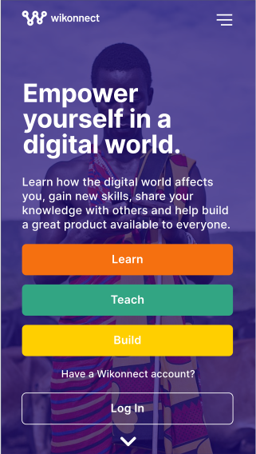
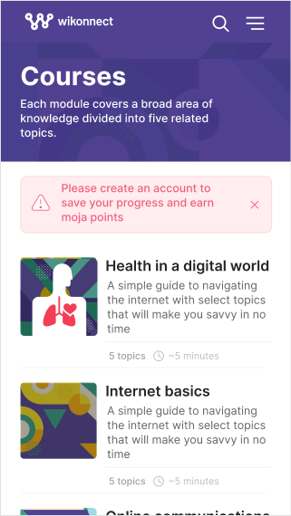

<!-- ALL-CONTRIBUTORS-BADGE:START - Do not remove or modify this section -->
[](#contributors)
<!-- ALL-CONTRIBUTORS-BADGE:END -->
  


<h1 align="center">Welcome to Wikonnect 👋</h1>
<p align="center">
  
  <a href="https://docs.wikonnect.org/" target="_blank">
    
  </a>
  <a href="#" target="_blank">
    
  </a>

  <a href="#" target="_blank">
    
  </a>

  <a href="#" target="_blank">
    
  </a>
  <a href="#" target="_blank">
    
  </a>
</p>

# Wikonnect

Wikonnect is an open-source e-learning platform designed to allow anyone to learn, create educational content, and
contribute to building the platform as a designer or a software developer. The initial courses offered on the platform will be around digital literacy, to get more people
using the internet in more productive ways. Developed by Tunapanda Institute in Nairobi, Kenya. The original platform (
called 'swag') was used to provide technology, design, and business training in low-income communities with low
bandwidth.


Getting Started
--
The frontend is developed using Ember.js. We
recommend [getting started](https://guides.emberjs.com/release/getting-started/quick-start/) with Ember by going through
the tutorials.

The backend is developed using [KoaJS](https://koajs.com/). The API docs are hosted
at [tunapanda.github.io/wikonnect)](https://tunapanda.github.io/wikonnect)

## Wikonnect Tech Stack

- [EmberJS](https://guides.emberjs.com) for frontend.
- [KoaJS](https://koajs.com/) for backend API.
- [Objection.js](https://vincit.github.io/objection.js/) as an ORM
  and [Knex.js](https://gist.github.com/NigelEarle/80150ff1c50031e59b872baf0e474977) for building SQL queries
- [PostgreSQL](https://www.postgresql.org/) for main persistence storage.
- [Redis](https://redis.io/) for in-memory data cache.
- [chai](https://www.chaijs.com/) for backend unit tests.
- [Cypress](https://cypress.io) for frontend integration tests.
- [Yarn](https://yarnpkg.com/) project package manager.

  #### Optional:
- [ElasticSearch](https://www.elastic.co/) for search and indexing services
- [Docker](https://www.docker.com/) for containerization

## Development setup

- Manually [download](https://codeload.github.com/tunapanda/wikonnect/zip/master) or clone the project
  using [Git](https://git-scm.com/) into your workspace:

```
  git clone https://github.com/tunapanda/wikonnect.git
 ```

- Proceed to set up the development environment manually or using Docker.

### Docker project setup

---

#### Prerequisites

- Docker Engine

##### Docker engine installation

- [Ubuntu installation](https://docs.docker.com/engine/install/ubuntu/)
- [Fedora installation](https://docs.docker.com/engine/install/fedora/)
- [Debian installation](https://docs.docker.com/engine/install/debian/)
- [Mac installation](https://docs.docker.com/docker-for-mac/install/) -Installed as docker desktop
- [Windows installation](https://docs.docker.com/docker-for-windows/install/)  -Installed as docker desktop

##### Docker Compose installation
- [Installation Instructions](https://docs.docker.com/compose/install/)

#### Starting a development server

1) If your Docker engine instance is running on your terminal, navigate into the **project root directory**:

```
cd wikonnect/
```

2) Rename the `.env-sample` configuration file to `.env`. (Never commit this file)

3) Update the above `.env` file configurations to match your desired setup.

4) Build and run the project container services using the `docker-compose` command:
    ```
      docker-compose up --build
    ````

**NOTE** The ``NODE_ENV`` should be set as ``development`` to allow live reload on code changes.


### Manual project setup

---

#### Prerequisites

- Node.js v14.16.0
- PostgreSQL database server
- Redis database server

##### Setting up Node.js

Follow instructions on how to download and install Node.js based on your operating system from
the [official Node.js website](https://nodejs.org/en/download/).

Ensure you install Node v14.16.0

##### Setting up PostgreSQL

- [Ubuntu installation](https://www.digitalocean.com/community/tutorials/how-to-install-and-use-postgresql-on-ubuntu-18-04)
- [Fedora installation](https://fedoraproject.org/wiki/PostgreSQL)
- [OSX installation](https://www.codementor.io/engineerapart/getting-started-with-postgresql-on-mac-osx-are8jcopb)
- [Windows installation](http://www.postgresqltutorial.com/install-postgresql/)

Create a postgres user (with password), and set up a database for the project (Don't forget to grant privileges to the user
on the database!). :

```SQL
=# CREATE USER my_user WITH PASSWORD 'my_password';
=# CREATE DATABASE my_database;
=# GRANT ALL PRIVILEGES ON DATABASE my_database TO my_user;
```

##### Setting up a Redis server

For macOS and Windows systems, check out the [download page](https://redis.io/download) on how to download and install a
Redis server.

To install on a Linux system, run the command below:

```
sudo apt-get install redis-server
```

After successful installation, confirm that the service is up and ready  using the following command:

```
sudo service redis-server status
```

If the service is not running, use the command below to start it:

```
sudo service redis-server start
```

#### Starting a development server

Install the project-wide dependencies on the **root project directory**...

```
cd wikonnect/
yarn
```

##### Backend (API) setup

---

Backend set up steps:

1) Navigate into the **server** directory
    ```
    cd server/
    ```
2) Install the backend dependencies
    ```
    yarn
    ```

3) Rename the database configuration file `server/config/db.example.js` to `server/config/db.js`

4) Replace the database configuration to match your development database. (Do not use the development database in a
   production environment)

    ```js
    development: {
        host: 'localhost',
        database: 'my_database',
        user: 'my_user',
        password: 'my_password',
      }
    ```

5) Assuming the Postgres server is ready and above [configuration](server/config/db.js) credentials are correct, run the
   latest migrations (defined in `server/migrations`):
    ```
     yarn db:init
    ```

6) **Optionally**, one can populate the database with dummy data (defined in `server/db/seeds`) by running:
    ```
     yarn db:seed
    ```

7) If the above steps were successful, you can finally start the backend server
   ```
   yarn start
   ```

**NOTE**: You can safely ignore any Elasticsearch connection error.

##### Frontend setup

---
Frontend set up steps:

1) Navigate into the **frontend** directory
    ```
    cd fronts
    ```
2) Install the frontend dependencies
    ```
    yarn
    ```
3) Start the frontend server
   ```
   yarn start
   ```
4) If the above steps were successful, navigate to your favorite browser and go to http://localhost:4200/ to see the running
   app.

***NOTE***: For easy Ember addons installation and project files generation using available blueprints, we highly
recommend installing [Ember CLI](https://github.com/ember-cli/ember-cli) globally:
```
yarn install -g ember-cli
```

## Designs

---

<table>

  <tr>
    <td></td>
    <td></td>
    <td></td>
  </tr>
 </table>

Head over to [Adobe XD](https://xd.adobe.com/view/4373354a-a52e-4413-4a61-8831bd731d75-3542/grid) to see the complete
design.

## Contributing

- You should join our [Discord](https://discord.gg/tT9Ug6D) server to get connected with people interested in this
  project and to be aware of our future announcements.
- Please read the
  suggested [steps to contribute code to the Wikonnect project](https://github.com/tunapanda/wikonnect/blob/master/CONTRIBUTING.md)
  before creating issues, forking, or submitting any pull requests.

## License

This project is licensed under MIT. See the [license](license) file for details

## Authors 🧙

### Lead developers

- **[Moses Okemwa](https://github.com/mosesokemwa)** - _Lead developer and maintainer_
- **[Proverbial Ninja](https://github.com/proverbial-ninja)** - _Lead developer and maintainer_

### Contributors ✨

Thanks goes to these wonderful people ([emoji key](https://allcontributors.org/docs/en/emoji-key)):

<!-- ALL-CONTRIBUTORS-LIST:START - Do not remove or modify this section -->
<!-- prettier-ignore-start -->
<!-- markdownlint-disable -->
<table>
  <tr>
    <td align="center"><a href="https://github.com/mosesokemwa"><br /><sub><b>Moses Okemwa</b></sub></a><br /><a href="https://github.com/tunapanda/wikonnect/commits?author=mosesokemwa" title="Code">💻</a> <a href="#design-mosesokemwa" title="Design">🎨</a></td>
    <td align="center"><a href="https://github.com/proverbial-ninja"><br /><sub><b>Kiki</b></sub></a><br /><a href="https://github.com/tunapanda/wikonnect/commits?author=proverbial-ninja" title="Code">💻</a> <a href="#design-proverbial-ninja" title="Design">🎨</a></td>
    <td align="center"><a href="https://github.com/mrlarso"><br /><sub><b>mrlarso</b></sub></a><br /><a href="https://github.com/tunapanda/wikonnect/commits?author=mrlarso" title="Code">💻</a></td>
    <td align="center"><a href="https://github.com/Jakeii"><br /><sub><b>Jake Lee Kennedy</b></sub></a><br /><a href="https://github.com/tunapanda/wikonnect/commits?author=Jakeii" title="Code">💻</a></td>
    <td align="center"><a href="https://github.com/bkmgit"><br /><sub><b>Benson Muite</b></sub></a><br /><a href="https://github.com/tunapanda/wikonnect/commits?author=bkmgit" title="Code">💻</a></td>
    <td align="center"><a href="http://colleowino.github.io/"><br /><sub><b>Cliff Owino</b></sub></a><br /><a href="https://github.com/tunapanda/wikonnect/commits?author=colleowino" title="Code">💻</a></td>
    <td align="center"><a href="https://github.com/Mutugiii"><br /><sub><b>Mutugi</b></sub></a><br /><a href="https://github.com/tunapanda/wikonnect/commits?author=Mutugiii" title="Code">💻</a></td>
  </tr>
  <tr>
    <td align="center"><a href="https://github.com/avicndugu"><br /><sub><b>Avic Ndugu</b></sub></a><br /><a href="https://github.com/tunapanda/wikonnect/commits?author=avicndugu" title="Code">💻</a></td>
    <td align="center"><a href="https://bonfacemunyoki.com/"><br /><sub><b>BonfaceKilz</b></sub></a><br /><a href="https://github.com/tunapanda/wikonnect/commits?author=BonfaceKilz" title="Code">💻</a></td>
  </tr>
</table>

<!-- markdownlint-enable -->
<!-- prettier-ignore-end -->
<!-- ALL-CONTRIBUTORS-LIST:END -->

<div align="center">
  <br>
  <h3>Happy Coding ❤︎</h3>
</div>

